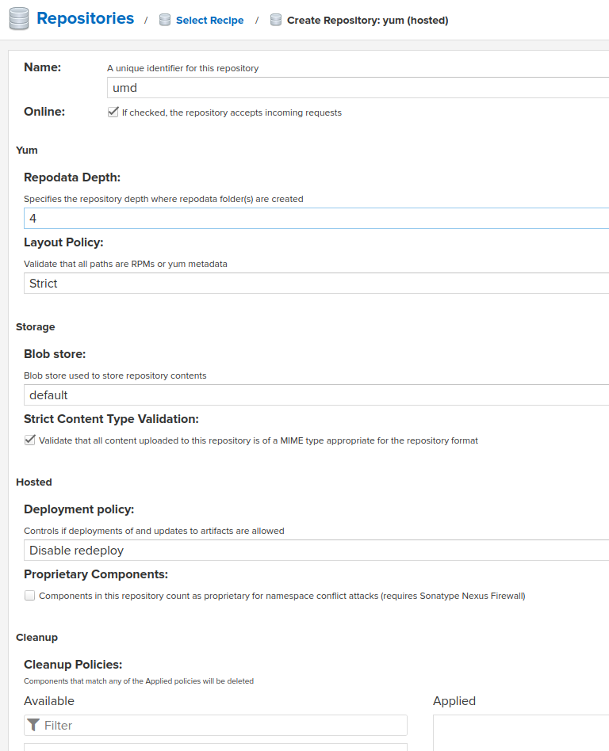

# Repositories for EGI UMD/CMD

EGI repository backend scripts and pipelines, for UMD/CMD releases.

The pipeline is as follows:

1. parse json, get the list of files to download and produce list of filenames (packages).
2. download the packages to a temporary directory.
3. rpm sign each package.
4. verify signature of each package.
    a. verification of the packages
5. upload each package to nexusrepo.
6. download each package from nexusrepo.
7. verify chksum and signature.
8. upload json to the frontend for publication.
9. clean temporary directories.

## Pre condition

### On nexusrepo

The repository in nexusrepo should be created manually, if it does not exist, with
the following settings:



The repository is called `umd` and is of `Type = hosted`.

* Create repository
* yum(hosted)
* Name: umd
* Repodata Depth: 0

Other options left to default.

### On frontend and backend

Create a user that can run all scripts and upload json from the backend to the frontend. On the
backend:

```bash
sudo useradd repo_user
su - repo_user
ssh-keygen
```

On the frontend, we also create the same user but the home directory will be the location of the
json files:

```bash
sudo useradd -d /var/www/html/json_dir repo_user
chmod 755 json_dir/
su - repo_user
mkdir .ssh
chmod 700 .ssh
cd .ssh
vim authorized_keys

## Put id_rsa.pub ssh key created in the backend host
```

### Configuration options and Environment variables

The file `repo.conf` contains configuration options. These options can also be set by environment
variables:

| `repo.conf`    | `ENV_VARIABLE`     | Comment                                             |
| ---------------| ------------------ | --------------------------------------------------- |
| `repo_uri`     | `UMD_REPO_URI`     | Nexus repository URI                                |
| `repo_admin`   | `UMD_REPO_ADMIN`   | Nexus admin user able to upload packages            |
| `repo_pass`    | `UMD_REPO_PASS`    | Nexus admin password                                |
| `tmp_base_dir` | `UMD_TMP_BASE_DIR` | tmp directory to host the packages under validation |
| `fe_ip`        | `UMD_FE_IP`        | Frontend IP of repository                           |
| `fe_user`      | `UMD_FE_USER`      | Frontend user allowed to copy json files            |
| `fe_json_dir`  | `UMD_FE_JSON_DIR`  | Frontend directory for the json files               |

## Script: json_parser.py

The script `json-parser.py` implements item **1** from the pipeline:

If the json file is `~/software-releases/json/htcondor.json`, the script should be executed as follows:

```bash
cd scripts
python3 json_parser.py ~/software-releases/json/htcondor.json
```

1. Read json file with product information: `json/htcondor.json`
2. Create a dictionary with packages: URLs: variable `pkg_dict`
3. Write a list of packages to a file: `/tmp/umdcmd/htcondor.lst`

## Script: download_pkgs.py (option 0)

The script `download_pkgs.py` implements item **2** (with option `0`) from the pipeline:

If the json file is `json/htcondor-9.0.1.json`, the script should be executed as follows:

```bash
cd scripts
python3 download_pkgs.py ~/software-releases/json/htcondor.json 0
```

1. Download packages to temporary directory: `/tmp/umdcmd/htcondor`, the option `0` means
the download is from the external source. Below the same script is run to download from the UMD/CMD
repository with option `1`.

## Script: rpm_sign.sh (option 0)

The script `rpm_sign.sh` implements item **3** and **4** from the pipeline, if you pass option `0`,
it sign and verifies all packages. To list all rpm gpg keys:

```bash
rpm -q gpg-pubkey --qf '%{name}-%{version}-%{release} --> %{summary}\n'

gpg-pubkey-f4a80eb5-53a7ff4b --> gpg(CentOS-7 Key (CentOS 7 Official Signing Key) <security@centos.org>)
gpg-pubkey-d60a5e99-621398b3 --> gpg(RPM sign UMD/CMD <grid.admin@lip.pt>)
gpg-pubkey-352c64e5-52ae6884 --> gpg(Fedora EPEL (7) <epel@fedoraproject.org>)
```

The RPMs should be signed with gpg key:
`gpg-pubkey-d60a5e99-621398b3 --> gpg(RPM sign UMD/CMD <grid.admin@lip.pt>)`

Verify that you have the file in the home directory:

```bash
cat .rpmmacros

%_signature gpg
%_gpg_path /home/centos/.gnupg
%_gpg_name RPM sign UMD/CMD
%_gpgbin /bin/gpg
%__gpg_sign_cmd %{__gpg} gpg --batch --no-verbose --no-armor --pinentry-mode loopback --passphrase 'xxxyyy' --no-secmem-warning -u "%{_gpg_name}" -sbo %{__signature_filename} --digest-algo sha256 %{__plaintext_filename}
```

Execute this script as follows:

```bash
./rpm_sign.sh htcondor 0
```

## Script: upload_pkgs.py

The script `upload_pkgs.py` implements item **5** from the pipeline:

If the json file is `json/htcondor-9.0.1.json`, the script should be executed as follows:

```bash
cd scripts
python3 upload_pkgs.py htcondor-9.0.1
```

1. Upload packages to nexusrepo

## Script: download_pkgs.py (option 1)

The script `download_pkgs.py` implements item **6** (with option `1`) from the pipeline:

If the json file is `json/htcondor-9.0.1.json`, the script should be executed as follows:

```bash
cd scripts
python3 download_pkgs.py htcondor-9.0.1 1
```

1. Download packages to temporary directory: `/tmp/umdcmd/htcondor-9.0.1/umdrepo_download`,
the option `1` means the download is from the UMD/CMD

## Script: rpm_sign.sh (option 1)

The script `rpm_sign.sh` implements item **7** from the pipeline, if you pass option `1`,
verifies all packages downloaded from the UMC/CMD repository. Execute this script as follows:

```bash
./rpm_sign.sh htcondor-9.0.1 1
```

## Script: upload_json.sh

The script `upload_json.sh` implements item **8** from the pipeline, it upload the json file with
rsync to the host of the repository frontend. Execute this script as follows:

```bash
./upload_json.sh htcondor-9.0.1
```

## Script: clean.sh

The script `clean.sh` implements item **9** from the pipeline, that is it cleans/removes the
temporary directory.

```bash
./clean.sh
```

## Full pipeline summary

```bash
cd scripts
python3 json_parser.py htcondor-9.0.1
python3 download_pkgs.py htcondor-9.0.1 0
./rpm_sign.sh htcondor-9.0.1 0
python3 upload_pkgs.py htcondor-9.0.1
python3 download_pkgs.py htcondor-9.0.1 1
./rpm_sign.sh htcondor-9.0.1 1
./upload_json.sh htcondor-9.0.1
./clean.sh
```
